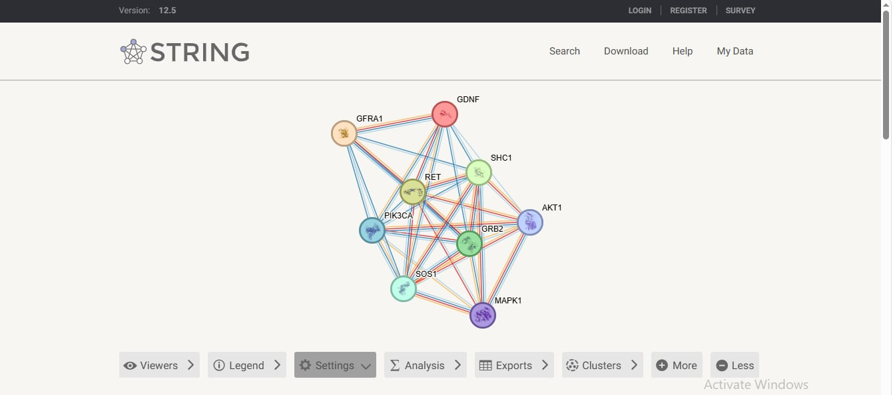
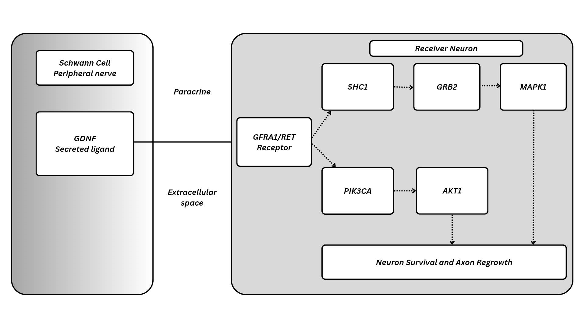

# Cell-Cell-Communication

# Schwann Cells as Senders: A GDNF Signaling Route to Neurons

# Research Question

After nerve injury, how might Schwann cells use the secreted protein GDNF to send a survival and regrowth signal to neurons through the GFRA1/RET receptor complex, and how well do public databases support each step?

# Chosen sender cell and biological context

| Item | Answer |
|---|---|
| Sender cell | Schwann cell |
| Tissue | Peripheral nerve |
| Biological context | Peripheral nerve injury and repair |
| Why it is a meaningful sender | After injury, Schwann cells switch to a repair state and release secreted factors that act on nearby neurons |
| Main purpose of the communication | May support neuron survival and axon regrowth |

After peripheral nerve injury, Schwann cells wrap and support axons, and in the repair state they communicate with neighbouring neurons through secreted proteins. I began with this cell and its biology, and I identified the signal (GDNF) from evidence in the next section.

## Candidate ligand and evidence for sender-cell expression

| Item | Answer |
|---|---|
| Candidate ligand | GDNF (glial cell line-derived neurotrophic factor) |
| Gene / UniProt | GDNF / P39905 (human) |
| Protein type | Secreted neurotrophic factor |
| Signaling type | Paracrine (my inference) |

**Evidence that Schwann cells produce GDNF**

- **Human Protein Atlas:** the single cell data for GDNF did not list Schwann cells, so HPA does not directly confirm expression in this cell type. I therefore used published literature as the main evidence.
- **Literature:** Xu et al. (2013) reported that after peripheral nerve injury, Schwann cells increase GDNF expression (PMID 23553603). This study used a rat sciatic nerve model, so it is animal evidence, and applying it to human Schwann cells is an inference.
- **UniProt:** GDNF is annotated as secreted. UniProt describes it as a neurotrophic factor that acts through the coreceptor GFRA1 and the RET receptor.

**Why paracrine:** GDNF is secreted, and Schwann cells sit next to the axons of neurons they support, so the signal most likely acts on nearby cells rather than through the bloodstream (endocrine).

# Receptor and receiver cell with supporting evidence

| Item | Answer |
|---|---|
| Ligand | GDNF |
| Receptor | GFRA1 (co-receptor that binds GDNF) and RET (signaling receptor tyrosine kinase) |
| Receiver cell | Neuron |
| Signaling context | Peripheral nerve injury and repair |

**Checkpoint sentence:** The Schwann cell produces GDNF, which can signal through GFRA1/RET on neurons in the context of peripheral nerve repair.

**Evidence for the receptor**

- **UniProt (P39905):** GDNF is described as acting through its coreceptor GFRA1, leading to activation of the RET receptor.
- **OmniPath (human):** GDNF is listed with GFRA1 (24 references) and RET (28 references), with ligand-receptor resources such as CellTalkDB and Cellinker among the sources.
- **IntAct:** a human GFRA1-GDNF record is present (see the IntAct section).

**Evidence for the receiver cell**

- **Human Protein Atlas:** [write what you saw for RET and GFRA1 in the Single cell or Brain sections, for example "RET and GFRA1 show expression in neurons"].
- **UniProt / literature:** UniProt describes GDNF as a neurotrophic factor that supports neuron survival. [Add one paper or UniProt expression note if you have one.]

**Limitation:** OmniPath is a general database and is not specific to Schwann cells or neurons. HPA expression of a receptor does not prove that this signaling occurs between these two cells. The choice of neurons as the receiver is therefore partly an inference.

# OmniPath findings

I searched OmniPath (organism: human) for GDNF and checked the Interactions and Intercell tabs.

**Interactions tab**

| Interaction | References | Example sources |
|---|---|---|
| GDNF → RET | 28 | Baccin2019, CellTalkDB, Cellinker |
| GDNF → GFRA1 | 24 | Baccin2019, CellTalkDB, Cellinker |
| GDNF → GFRA2 | 12 | Baccin2019, CellTalkDB, Cellinker |

GDNF is listed with both parts of the receptor complex in my model, GFRA1 and RET. The sources include ligand-receptor resources (CellTalkDB, Cellinker). GFRA2 also appears, but I focused on GFRA1 because UniProt names GFRA1 as the GDNF co-receptor.

**Intercell tab**

The Intercell tab lists 44 annotations for GDNF. The rows I examined give the location as "Secreted," supported by Cellinker, OmniPath, UniProt keyword, UniProt location, HPA secretome, and connectomeDB. This agrees with the UniProt annotation and supports GDNF acting as an extracellular signal.

**Interpretation**

OmniPath supports GDNF being a secreted ligand that interacts with GFRA1 and RET. It does not show that this happens between Schwann cells and neurons, because OmniPath is a general database that is not specific to one cell type. The cell-specific link is my inference, supported by the literature and HPA evidence in the other sections.

# STRING network image and interpretation

The STRING network shows a highly connected group of proteins involved mainly in growth factor receptor signaling. The enriched term insulin-like growth factor receptor signaling pathway had a very low FDR of 2.07 × 10⁻¹¹, indicating significant enrichment. Key connector proteins include SHC1, GRB2, PIK3CA, AKT1, and MAPK1, which link receptor activation to downstream PI3K/AKT and MAPK signaling pathways involved in cell growth, survival, proliferation, and differentiation. Overall, the dense network suggests that these proteins work together in coordinated cell-signaling processes.

**Relevant enrich term:** Insulin-like growth factor receptor signaling pathway 

**FDR:** 2.07 × 10⁻¹¹

**5 proteins with roles**

1. **SHC1** – Acts as a signaling adaptor that connects activated growth-factor receptors to downstream pathways, including the GRB2/SOS–Ras signaling cascade.

2. **GRB2** – Functions as an adaptor protein that links activated cell-surface receptors to downstream signaling pathways such as Ras/MAPK.

3. **PIK3CA** – Encodes the catalytic subunit of PI3K, which phosphorylates PIP2 to produce PIP3 and helps activate PI3K/Akt signaling.

4. **AKT1** – A serine/threonine kinase that regulates important processes such as cell growth, proliferation, metabolism, and cell survival. 

5. **MAPK1** – A MAP kinase involved in the MAPK/ERK signaling cascade, regulating processes including cell growth, survival, differentiation, and proliferation.

# IntAct Validation: GFRA1–GDNF

| **Item** | **Information** |
|---|---|
| **Protein pair** | GFRA1 – GDNF |
| **IntAct record** | EBI-15654678 |
| **Interaction type** | Direct interaction |
| **Experimental detection method** | ELISA |
| **Organism** | *Homo sapiens* (human) |
| **Host organism** | In vitro |
| **Positive interaction** | Yes |
| **Publication** | Kjær et al. (2010), "Mammal-restricted elements predispose human RET to folding impairment by HSCR mutations" |
| **Journal** | Nature Structural & Molecular Biology |
| **Publication reference** | PMID: 20473317; DOI: [https://doi.org/10.1038/nsmb.1808](https://doi.org/10.1038/nsmb.1808) |
| **Evidence conclusion** | Supports a direct physical interaction between GFRA1 and GDNF based on a positive ELISA experiment reported in IntAct. |

I chose **GDNF and GFRA1** because GDNF is a ligand and GFRA1 is its co-receptor in the proposed GDNF signaling pathway. The IntAct record shows that the two human proteins have a **direct interaction** supported by a positive **ELISA** experiment. The interaction is associated with the study by Kjær et al. (2010), which investigated human RET and its interactions with components related to GDNF signaling. This provides experimental evidence supporting the proposed **GDNF → GFRA1** ligand-receptor interaction. Since IntAct already provides experimental evidence for this protein pair, examining another pair is not necessary.

# Final model and 150–250 word interpretation

The model illustrates how Schwann cells can support the survival and regeneration of peripheral neurons through GDNF-mediated signaling. In this pathway, the Schwann cell acts as the sender cell, releasing GDNF as a secreted ligand into the extracellular space. The receiving neuron contains the GFRA1/RET receptor complex, which recognizes GDNF and initiates intracellular signaling. Once activated, the receptor can stimulate the SHC1–GRB2–MAPK1 pathway, which is associated with cellular responses involved in neuronal growth and regeneration. At the same time, signaling through PIK3CA and AKT1 promotes cell survival and helps maintain neuronal viability.

The two pathways converge on the biological outcome of neuron survival and axon regrowth. This suggests that GDNF signaling provides both survival and regenerative support to neurons following peripheral nerve injury. The model also demonstrates the importance of communication between Schwann cells and neurons, because Schwann-cell-derived signals can influence intracellular processes in neighboring neurons. Overall, the proposed pathway connects the ligand-receptor interaction GDNF → GFRA1/RET with downstream signaling through MAPK1 and AKT1, ultimately supporting neuronal recovery and axonal regeneration.

# Questions and Answers

**1. What sender cell did you choose, and in what tissue or biological context does it act?**

The sender cell is the Schwann cell, which is found in the peripheral nervous system (PNS). Schwann cells support peripheral neurons by providing signals that promote neuronal survival, maintenance, and axon regeneration, especially during peripheral nerve repair.

**2. What signaling molecule did you identify, and what evidence supports its production or presentation by the sender cell?**

The signaling molecule identified is GDNF (glial cell line-derived neurotrophic factor). Schwann cells can produce and release GDNF, particularly in response to peripheral nerve injury. GDNF acts as a neurotrophic factor that supports the survival and regeneration of nearby neurons.

**3. What receptor receives the signal, and which receiver cell did you select?**

The receptor system is the GFRA1/RET receptor complex, involving GFRA1 (GDNF family receptor alpha-1) and RET. The receiver cell selected is the neuron, specifically a peripheral neuron receiving GDNF from the Schwann cell.

**4. What type of cell-to-cell signaling is represented?**

The pathway represents paracrine signaling because GDNF is released by the Schwann cell and acts on a nearby neuron rather than traveling through the bloodstream to a distant target.

**5. Which proteins in your STRING network appear most relevant to the receptor-associated response? Explain briefly.**

The most relevant proteins are SHC1, GRB2, MAPK1, PIK3CA, and AKT1. SHC1 and GRB2 are associated with downstream signaling from RET and can lead to activation of MAPK1. PIK3CA and AKT1 form another important pathway involved in cell survival. Together, these proteins connect GFRA1/RET activation to neuronal survival and growth responses.

**6. What enriched pathway or biological process is consistent with your proposed mechanism?**

The proposed mechanism is consistent with PI3K-AKT signaling and MAPK signaling, which are involved in cell survival, growth, and differentiation. These pathways are consistent with the biological processes of neuron survival and axon regeneration.

**7. What did IntAct show for the molecular interaction you examined? What type of evidence was reported?**

IntAct showed a positive direct interaction between GFRA1 and GDNF in Homo sapiens. The interaction was experimentally detected using ELISA, with the experiment reported as in vitro. This provides experimental evidence supporting the physical interaction between GDNF and its GFRA1 receptor/co-receptor.

**8. Which parts of your final model are strongly supported, and which parts remain an inference?**

The GDNF–GFRA1 interaction is strongly supported by the IntAct experimental evidence. The involvement of RET and downstream proteins such as SHC1, GRB2, MAPK1, PIK3CA, and AKT1 is also consistent with known GDNF/RET signaling. However, the complete sequence from Schwann-cell GDNF secretion → GFRA1/RET → SHC1/GRB2/MAPK1 and PIK3CA/AKT1 → axon regrowth is a proposed model, so the specific connection between all components in this particular Schwann cell–neuron context remains an inference.

**9. What cellular response is expected in the receiver cell, and why?**

The expected response is increased neuron survival and axon regrowth. GDNF signaling through the GFRA1/RET receptor complex activates downstream pathways such as MAPK and PI3K-AKT, which promote neuronal survival, growth, and regenerative responses. Therefore, the neuron is expected to be better supported during peripheral nerve repair.

# References and database links

HPA: https://www.proteinatlas.org/ENSG00000168621-GDNF/single+cell

OmniPath: https://explore.omnipathdb.org/search?q=GDNF%2C&tab=interactions&species=9606

STRING: https://string-db.org/cgi/network?taskId=b2GSV12GGHA2&sessionId=beYahQK91iV4&__cf_chl_tk=pEaKfoqX7s.GjyqCQr7mGU6uaidZ_FJK4VVj6Z9IlSI-1791430365-1.0.1.1-cR.znUk5v8X5ImhSI9Ytm.02.TNEO3ajwXNtKWQiRrU

IntAct : https://www.ebi.ac.uk/intact/search?query=GDNF%20GFRA1

Xu P, Rosen KM, Hedstrom K, Rey O, Guha S, Hart C, Corfas G. Nerve injury induces glial cell line-derived neurotrophic factor (GDNF) expression in Schwann cells through purinergic signaling and the PKC-PKD pathway. Glia. 2013;61(7):1029-1040. doi:10.1002/glia.22491. PMID: 23553603.
