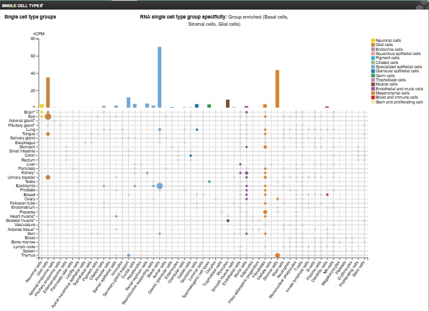
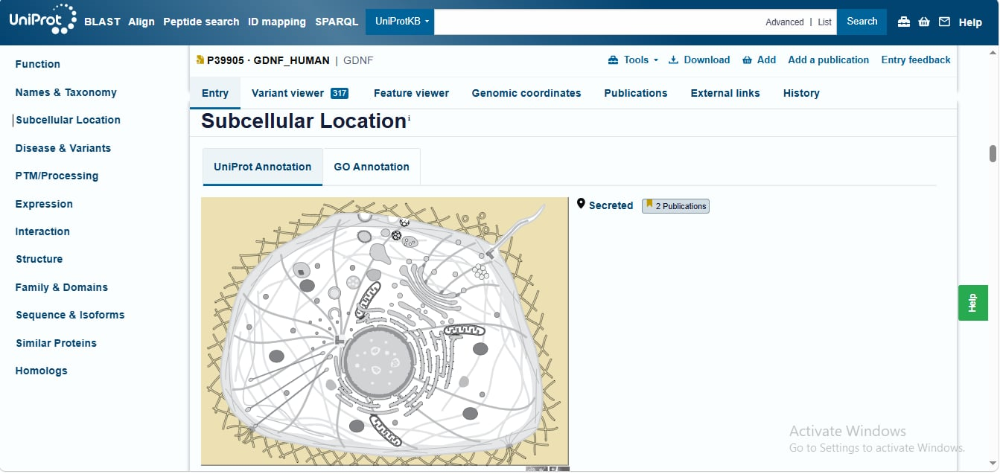
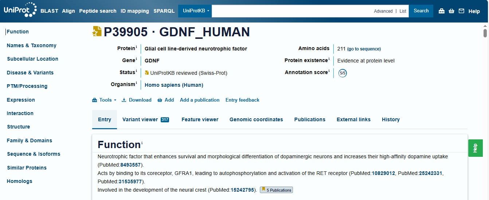
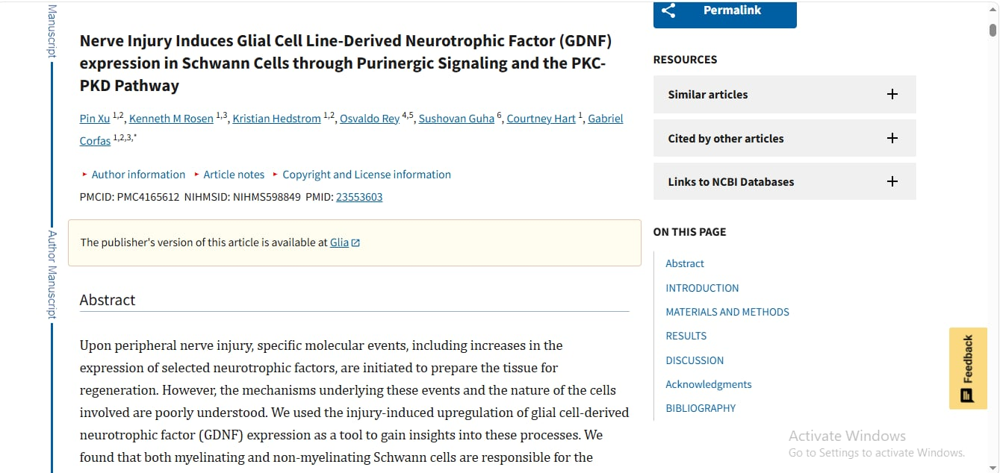
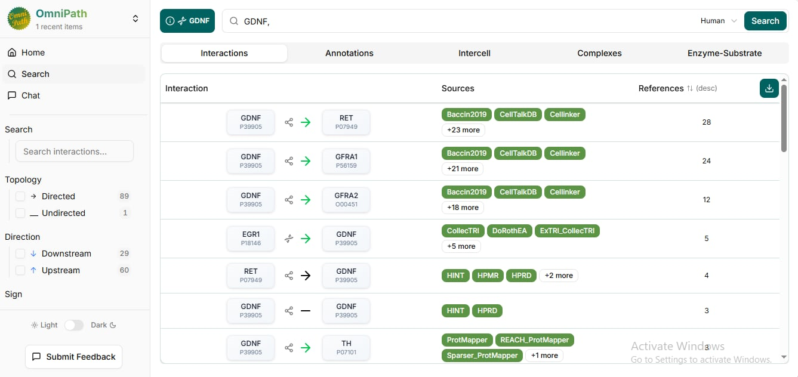
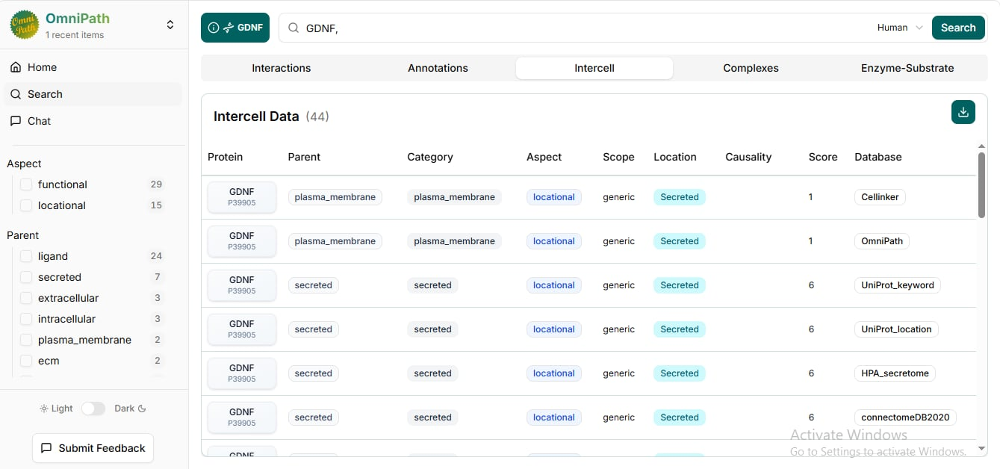
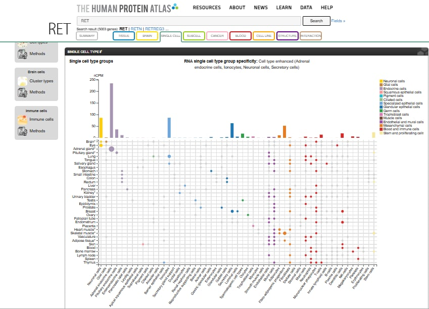
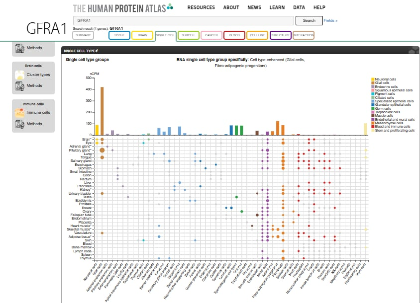

# Cell-Cell-Communication

# Schwann Cells as Senders: A GDNF Signaling Route to Neurons

# Research Question

After nerve injury, how might Schwann cells use the secreted protein GDNF to send a survival and regrowth signal to neurons through the GFRA1/RET receptor complex, and how well do public databases support each step?

# Chosen sender cell and biological context

| Item | Answer |
|---|---|
| Sender cell | Schwann cell |
| Tissue | Peripheral nerve |
| Biological context | Peripheral nerve injury and repair |
| Why it is a meaningful sender | After injury, Schwann cells switch to a repair state and release secreted factors that act on nearby neurons |
| Main purpose of the communication | May support neuron survival and axon regrowth |

After peripheral nerve injury, Schwann cells wrap and support axons, and in the repair state they communicate with neighbouring neurons through secreted proteins. I began with this cell and its biology, and I identified the signal (GDNF) from evidence in the next section.

## Candidate ligand and evidence for sender-cell expression

| Item | Answer |
|---|---|
| Candidate ligand | GDNF (glial cell line-derived neurotrophic factor) |
| Gene / UniProt | GDNF / P39905 (human) |
| Protein type | Secreted neurotrophic factor |
| Signaling type | Paracrine (my inference) |

**Evidence that Schwann cells produce GDNF**

- **Human Protein Atlas:** the single cell data for GDNF did not list Schwann cells, so HPA does not directly confirm expression in this cell type. I therefore used published literature as the main evidence.
- **Literature:** Xu et al. (2013) reported that after peripheral nerve injury, Schwann cells increase GDNF expression (PMID 23553603). This study used a rat sciatic nerve model, so it is animal evidence, and applying it to human Schwann cells is an inference.
- **UniProt:** GDNF is annotated as secreted. UniProt describes it as a neurotrophic factor that acts through the coreceptor GFRA1 and the RET receptor.

**Why paracrine:** GDNF is secreted, and Schwann cells sit next to the axons of neurons they support, so the signal most likely acts on nearby cells rather than through the bloodstream (endocrine).

# Receptor and receiver cell with supporting evidence

| Item | Answer |
|---|---|
| Ligand | GDNF |
| Receptor | GFRA1 (co-receptor that binds GDNF) and RET (signaling receptor tyrosine kinase) |
| Receiver cell | Neuron |
| Signaling context | Peripheral nerve injury and repair |

**Checkpoint sentence:** The Schwann cell produces GDNF, which can signal through GFRA1/RET on neurons in the context of peripheral nerve repair.

**Evidence for the receptor**

- **UniProt (P39905):** GDNF is described as acting through its coreceptor GFRA1, leading to activation of the RET receptor.
- **OmniPath (human):** GDNF is listed with GFRA1 (24 references) and RET (28 references), with ligand-receptor resources such as CellTalkDB and Cellinker among the sources.
- **IntAct:** a human GFRA1-GDNF record is present (see the IntAct section).

**Evidence for the receiver cell**

- **Human Protein Atlas:** [write what you saw for RET and GFRA1 in the Single cell or Brain sections, for example "RET and GFRA1 show expression in neurons"].
- **UniProt / literature:** UniProt describes GDNF as a neurotrophic factor that supports neuron survival. [Add one paper or UniProt expression note if you have one.]

**Limitation:** OmniPath is a general database and is not specific to Schwann cells or neurons. HPA expression of a receptor does not prove that this signaling occurs between these two cells. The choice of neurons as the receiver is therefore partly an inference.

# OmniPath findings

I searched OmniPath (organism: human) for GDNF and checked the Interactions and Intercell tabs.

**Interactions tab**

| Interaction | References | Example sources |
|---|---|---|
| GDNF → RET | 28 | Baccin2019, CellTalkDB, Cellinker |
| GDNF → GFRA1 | 24 | Baccin2019, CellTalkDB, Cellinker |
| GDNF → GFRA2 | 12 | Baccin2019, CellTalkDB, Cellinker |

GDNF is listed with both parts of the receptor complex in my model, GFRA1 and RET. The sources include ligand-receptor resources (CellTalkDB, Cellinker). GFRA2 also appears, but I focused on GFRA1 because UniProt names GFRA1 as the GDNF co-receptor.

**Intercell tab**

The Intercell tab lists 44 annotations for GDNF. The rows I examined give the location as "Secreted," supported by Cellinker, OmniPath, UniProt keyword, UniProt location, HPA secretome, and connectomeDB. This agrees with the UniProt annotation and supports GDNF acting as an extracellular signal.

**Interpretation**

OmniPath supports GDNF being a secreted ligand that interacts with GFRA1 and RET. It does not show that this happens between Schwann cells and neurons, because OmniPath is a general database that is not specific to one cell type. The cell-specific link is my inference, supported by the literature and HPA evidence in the other sections.

